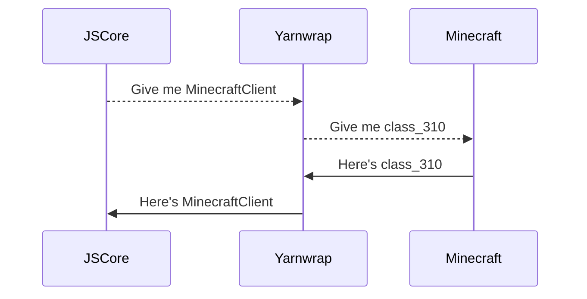

# JSCore - Minecraft Modding for the Uncommitted

JSCore allows modules **written in JavaScript** to access Minecraft internals, giving it capabilities **on-par with traditional modding\*** with a fraction of the hassle required.

- **No setup/IDE required** to create a module.
- **Hot reloads** - restart **_not required_** to apply change.
- Over **20,000 internal Java methods** available.

_\*Only for customisations depending on [events](https://wiki.fabricmc.net/tutorial:event_index), there will be very limited support mixins in the future._

### Quick Links

- JSCore ([GitHub](https://github.com/FabricCore/JSCore))
- Yarnwrap ([GitHub](https://github.com/FabricCore/yarnwrap))
- Package repository ([GitHub](https://github.com/FabricCore/repo))
- Yarnwrap Index (TBD)
- JSCore book (TBD)

## Why use JSCore?

With reference to the diagram below **(unbiased)**


### Developer Friendly

JSCore modules are **easy to write**, because you already know it.

- **Familiar** language features with JavaScript.

```js
function main(ctx) {
  let arg = StringArgumentType.getString(ctx, "message");
  console.log(`User said "${argument}".`);
}
```

- **Declarative** command registration.

```js
Command.register({
  package: "modules/mymodule",
  name: "mycmd",
  execute: "nooptions.js",

  subcommands: {
    name: {
      execute: "noname.js"
      args: {
        username: {
          type: StringArgumentType.greedyString(),
          execute: "withname.js"
        }
      }
    },
  }
});
```

- Depend on **pre-made modules** from the community.

```js
{
    "name": "mymodule",
    "version": "0.1.0",

    "dependencies": {
        "toggle": "0.1.0",
        "keep": "0.1.0"
    },
    "javaDependencies": [
        "yarnwrap"
    ]
    // ...
}
```

### User Friendly

JSCore modules are **easy to install** using a **_package manager_** - no manual downloads, no restarting required.

```js
/pully install package
```

_There is also a `pully update` command which does exactly what you think it does_.

## When to Use JSCore?

Use JSCore when:

- Creating **very small modules**, such as chat or movement related functions.
- Writing **player automations** that uses events such as **onTick**.
- Users are allowed to **define custom behaviour** using JavaScript.
- Many different modules **depend on one another\***.

_\*It is good practice for each module to do one task and one task only (see [the Unix Philosophy](https://en.wikipedia.org/wiki/Unix_philosophy))_.

Baritone - the Minecraft path finding automation is ***technically possible*** in JSCore.

### When not to use JSCore?

Do not use JSCore if:
- Key parts of your module **rely on mixins**, as it is not ready yet.
- Library you are accessing requires **Java specific language features**, such as class inheritance.

## How does JSCore Work?

JSCore contains the [Rhino](https://rhino.github.io/) JavaScript runtime, which allows Java classes and methods to be accessed from JS.

### Problem with Obfuscation

Mods that uses JavaScript such as [ChatTriggers](https://chattriggers.com/) cannot access Minecraft internals because they are obfuscated. For example, **net.minecraft.client.MinecraftClient** is obfuscated to **net.minecraft.class_310**, making it inaccessible by its original name.

The workaround to obfuscation requires [Yarnwrap](https://github.com/FabricCore/yarnwrap) which translates the human readable name into the obfuscated name when it is accessed.



### Wraps and Cores

- A **core** provides a runtime for a scripting language.
- A **wrap** exposes some Minecraft internals to the scripting runtime.

In this case, **Yarnwrap** exposes 20k obfuscated methods to any scripting runtime. Similarly, **Mixinwrap** (to be written) will expose some Mixin functionalities as events that can be listened to.


